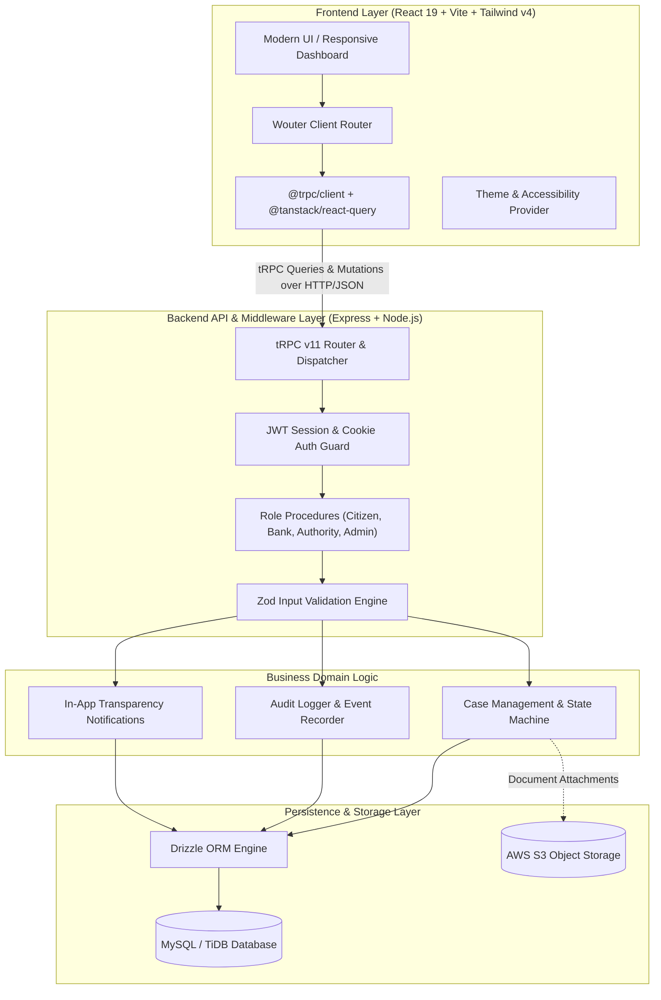
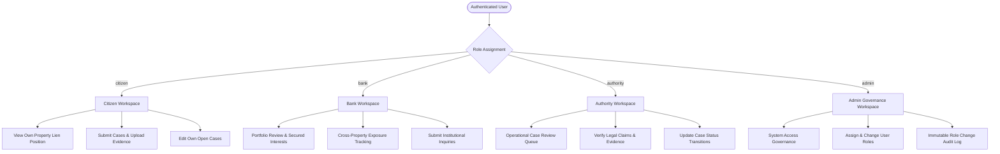
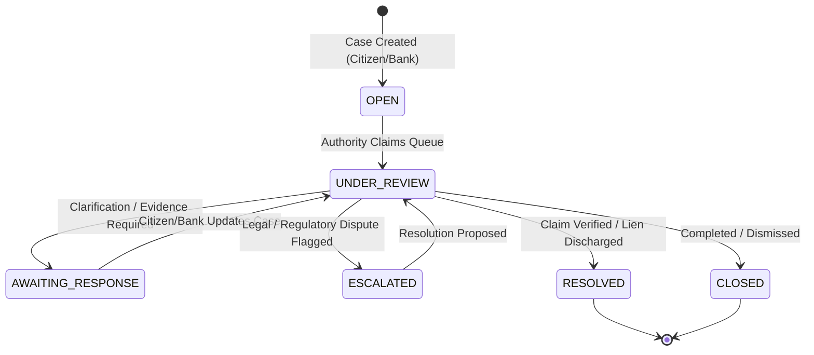
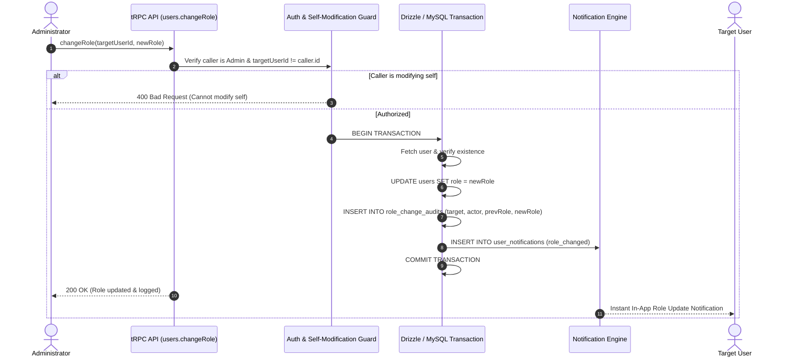
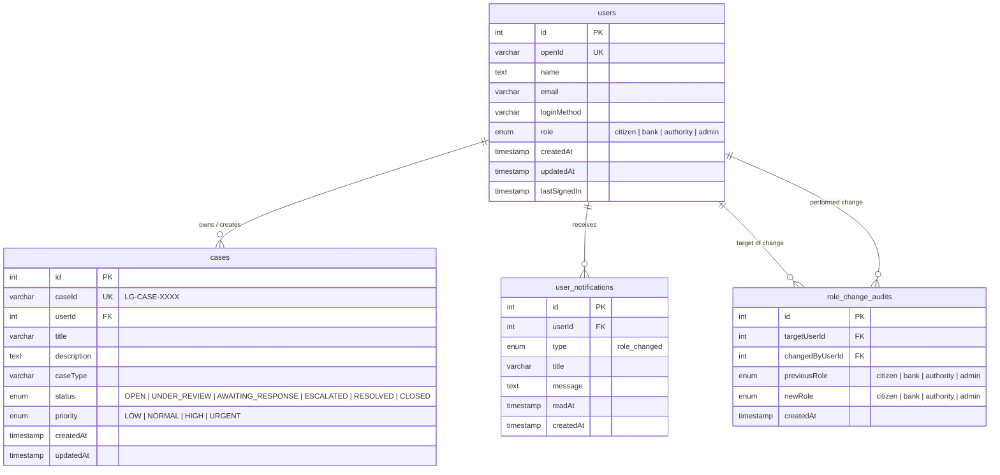

# LienGuard Technical Architecture

LienGuard is a distributed, end-to-end Property Lien Management and Dispute Governance platform engineered for security, compliance, auditability, and speed.

---

## 1. System Architecture

---

## 2. Role-Based Access Control (RBAC) Matrix

LienGuard enforces strict, multi-tiered access control based on user roles:

### Access Permission Matrix

| Operation / Procedure | Citizen | Bank | Authority | Admin |
| :--- | :---: | :---: | :---: | :---: |
| `auth.me` / `auth.logout` | :white_check_mark: | :white_check_mark: | :white_check_mark: | :white_check_mark: |
| `workspace.overview` | :white_check_mark: | :white_check_mark: | :white_check_mark: | :white_check_mark: |
| `cases.create` | :white_check_mark: | :white_check_mark: | :white_check_mark: | :white_check_mark: |
| `cases.list` (scoped to owner / portfolio) | Own Cases | Assigned Portfolio | All Verified | All Cases |
| `cases.get` | Own Cases | Assigned Portfolio | All Verified | All Cases |
| `cases.update` (details) | Own Open Cases | Interest Cases | :white_check_mark: | :white_check_mark: |
| `cases.updateStatus` (state machine) | :x: | :x: | :white_check_mark: | :white_check_mark: |
| `users.list` | :x: | :x: | :x: | :white_check_mark: |
| `users.roleHistory` | :x: | :x: | :x: | :white_check_mark: |
| `users.changeRole` | :x: | :x: | :x: | :white_check_mark: |

---

## 3. Case State Machine Workflow

Cases follow a deterministic lifecycle model preventing illegal state mutations:

---

## 4. Role Governance & Audit Sequence

---

## 5. Database Schema (Entity Relationship Diagram)

